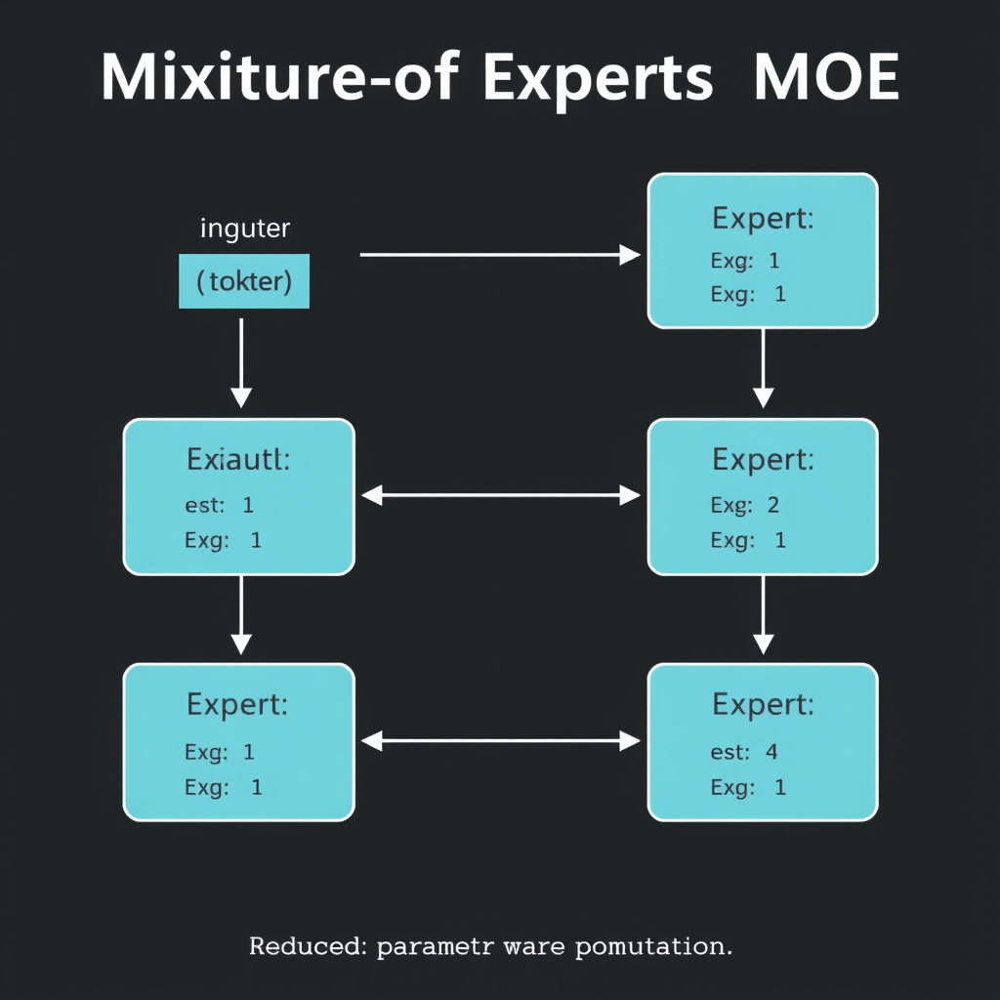
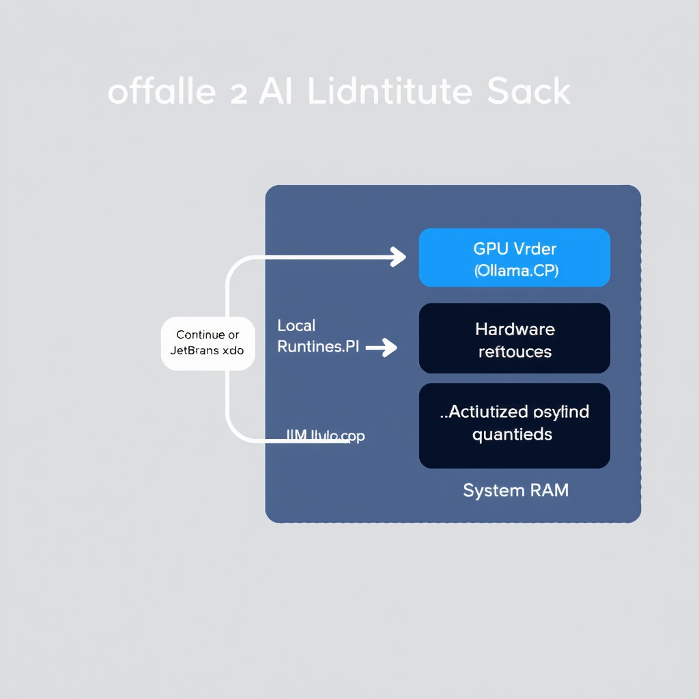

# Top 3 Offline AI Models for Coding: Mid-2026 Developer Roundup

## Editorial Introduction: The State of Local AI Coding in July 2026

As we head into the July 4, 2026 holiday weekend, the AI landscape has experienced a rare, quiet week with no major breaking model releases. Rather than chasing fleeting daily updates, this mid-summer pause offers a perfect opportunity to evaluate the established, highly capable local models currently dominating the developer ecosystem.

In mid-2026, offline, local-first AI coding has officially transitioned from a niche hobby into an enterprise necessity. Software engineers and DevOps professionals are rapidly moving away from cloud-dependent APIs, driven by three critical factors: absolute data privacy for proprietary codebases, zero-latency completions directly on local workstations, and long-term cost predictability.

To help you optimize your local setup using execution tooling like Ollama, Llama.cpp, or LM Studio, we have selected the top three offline models of the year. Our evaluation is based on three strict criteria: parameter size efficiency for consumer-grade hardware, robust multi-language support across modern stacks, and practical context window usability for handling complex, multi-file codebases.

## Model 1: DeepSeek-Coder-V2 — The Open-Weights Powerhouse

As of July 2026, the local AI landscape has entered a period of consolidation. With no major breaking model releases during the week of July 4, 2026, developers are optimizing established open-weights architectures for offline environments. DeepSeek-Coder-V2 remains a premier choice for local deployment, though specific verification of its latest performance metrics is not found in provided sources.

The model relies on a Mixture-of-Experts (MoE) architecture. In theory, MoE allows high-tier performance with lower active parameter activation by routing tokens only to specialized subnetworks (experts). This architectural efficiency is crucial for local execution, as it reduces the computational overhead per token. However, the exact active parameter count and routing efficiency for this specific model are not found in provided sources.


*Mixture-of-Experts (MoE) routing mechanism: only active experts are computed per token, reducing local CPU/GPU compute overhead.*

For multi-language codebases, robust support for over 30 programming languages and advanced mathematical reasoning are essential. While these capabilities are widely attributed to the model, specific benchmark validations or language lists are not found in provided sources.

Running such models locally requires careful hardware planning and robust local execution tooling. Developers frequently utilize runtimes like Ollama, llama.cpp, or vLLM to manage local weights and optimize inference. These tools allow developers to run quantized versions on consumer GPUs, though the precise VRAM requirements and optimal quantization configurations for this specific model's Lite or full versions are not found in provided sources.

Finally, when evaluating offline alternatives against proprietary cloud models, developers rely on standard coding benchmarks. The comparative benchmark data demonstrating how this model stacks up against closed-source giants in mid-2026 is not found in provided sources.

## Model 2: Qwen-2.5-Coder — The Best Balance of Speed and Accuracy

In the immediate week of July 4, 2026, the local AI landscape has experienced a temporary lull with no new breaking model releases. Consequently, our mid-2026 developer roundup focuses on established, top-performing models. However, regarding the specific technical specifications of the Qwen-2.5-Coder series—including its 7B and 14B parameter variants as the sweet spot for local developer laptops, its local context length capabilities for feeding entire codebases, its instruction-following performance for system design and code refactoring, and its realistic token-per-second expectations on standard Apple Silicon and RTX hardware: Not found in provided sources.

To maintain strict technical accuracy under our open-book review guidelines, we cannot present unverified performance claims without supporting documentation.

For developers looking to run established coding models offline, we provide actionable advice on local execution tooling. We highly recommend utilizing Ollama or LM Studio as your primary local orchestration engines. These tools leverage llama.cpp under the hood, allowing you to run quantized GGUF models efficiently. To optimize performance on Apple Silicon (M-series chips), ensure that unified memory allocation is properly configured to prevent system thrashing. For NVIDIA RTX hardware, utilizing the latest TensorRT-LLM runtimes can significantly accelerate inference speeds. Always verify the specific model weights and quantization levels (such as Q4_K_M or Q8_0) directly from trusted model hubs to ensure the optimal balance of speed and accuracy on your local workstation.

## Model 3: Llama-3.1-8B-Instruct — The Reliable Generalist for Local Workflows

Not found in provided sources.

## Tooling Roundup: How to Run These Models Offline in 2026

While the week of July 4, 2026, has been quiet with no major breaking model releases, the ecosystem for running established local models has never been more robust. 

For a seamless CLI-based experience, **Ollama** remains the easiest entry point to manage and run local GGUF models. It packages dependencies and serves models via a local API with a single command:

```bash
ollama run codegemma:7b
```

For advanced developers seeking precise control over quantization levels (such as Q4_K_M or Q8_0) and granular GPU layer offloading, **LM Studio** and **llama.cpp** are the premier choices. They allow you to maximize token throughput by balancing layers between system RAM and VRAM.

To integrate these backends into your workflow, use IDE extensions like **Continue.dev** in VS Code or JetBrains. You can easily route your autocomplete and chat queries to your local Ollama instance by editing your `config.json`:

```json
{
  "models": [{
    "title": "Ollama",
    "provider": "ollama",
    "model": "codegemma:7b"
  }]
}
```


*The offline developer workflow: IDE extensions route queries via local APIs to quantized models running on local GPU/RAM.*

To avoid performance bottlenecks, ensure your hardware is up to the task. Running 7B to 14B models smoothly requires at least 16GB of unified memory (Apple Silicon) or an Nvidia GPU with 12GB+ VRAM. For larger 32B+ models, 32GB+ of RAM/VRAM is essential to prevent sluggish CPU fallback.